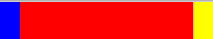
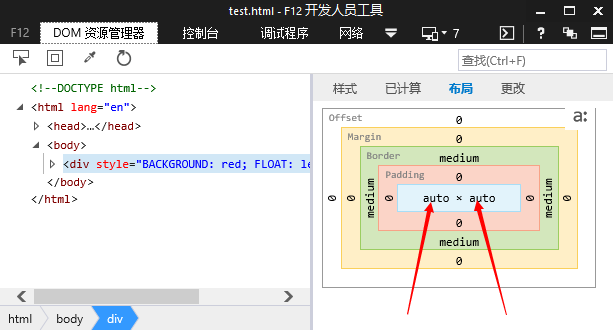
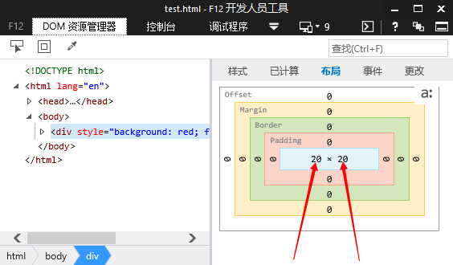
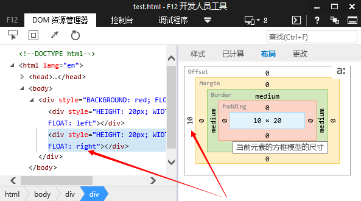

#(ie7-)父元素浮动+子元素左右浮动bug

##场景

当给父元素设置浮动（此时宽度默认为auto），并且子元素分别设置左右浮动后，导致父元素宽度100%

````html

<div style="float:left;background: red">
	<div style="float:left;background:blue;width:10px;height:20px;"></div>
	<div style="float:right;background:yellow;width:10px;height:20px;"></div>
</div>

````



##原因分析

通过查看开发者工具中的盒子模型得到以下对比图

ie7-8 父元素


ie9+  父元素


ie7   子元素


ie8+  父元素


##解决方案

将有浮动的子元素设置成左浮动

