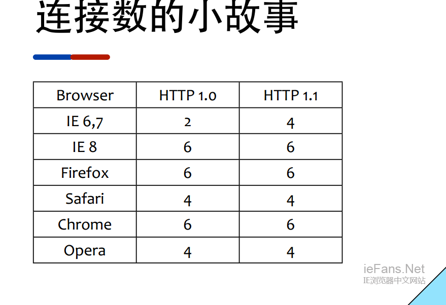

# HTTP1.0 keepalive 与 HTTP 2.0 多路复用 

## 三次握手与四次挥手

 
## 浏览器对**同一域名**进行请求的最大并发连接数

### ie9下 外部样式文件超过31个后不加载

> The problem you have is due to a limit that IE imposes on the number of stylesheets. IE can only load a maximum of 31 separate CSS files in a single page.

## 多路复用

## 参考

* (TCP协议中的三次握手和四次挥手)[http://blog.csdn.net/whuslei/article/details/6667471]
* http://stackoverflow.com/questions/14541724/ie8-ie9-does-not-load-css
* https://social.msdn.microsoft.com/Forums/ie/en-US/ad1b6e88-bbfa-4cc4-9e95-3889b82a7c1d/internet-explorer-imposes-a-maximum-limit-of-32-individual-stylesheet?forum=iewebdevelopment
* (借助 HTTP/2 打造更迅捷的 Web 体验)[https://www.w3ctech.com/topic/862]
