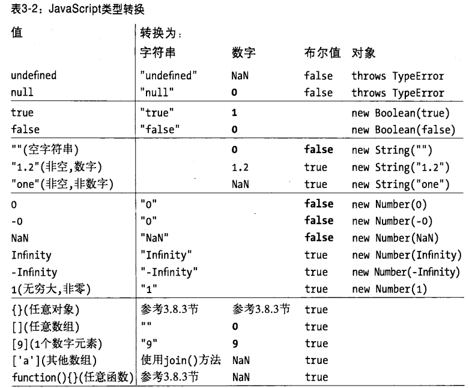

javascript的数据类型及转换
==========================

##数据类型概览

* null
* undefined
* 原始类型
	* 数字
	* 字符串
	* 布尔值
* 对象类型
	* 一般对象
	* 数组对象
	* 函数对象
		* 全局对象（global）
		* 数组对象（Array）
		* 正则对象（RegExp）
		* 日期对象（Date）
		* 错误对象（Error）
		* 一般函数对象（Function）

##数字

* javascript中素有的数字均用浮点数值表示。
* 采用IEEE 745标准定义的64位浮点格式表示数字。
最大值
* 整数范围（含边界值）：-253~253，超出范围，将不能保证低位数的精度。实际操作中（例如数组索引）基于32位整数。

		Math.pow(2,53)	 	//9007199254740992
		Math.pow(2,53)+1	//9007199254740992
		Math.pow(2,53)+2	//9007199254740994
		Math.pow(2,53)+3	//9007199254740996

* ECMAScript标准不支持8进制直接量。
* NaN、Infinity是只读属性，从ECMAScript5开始

		NaN==NaN 						//false
		isNaN(NaN)						//true  
		isNaN("1") 						//false
		isNaN("1 a") 					//false

		Infinity==Infinity 				//true
		Number.MAX_VALUE+1==Infinity 	//false
		isFinite(Number.MAX_VALUE+1)  	//true 通过isFinite判断是否是极限值

* 关于上溢出和下溢，书上36页有介绍
	
		0/0					//NaN 没有意义所以是NaN

		1/0					//Infinity
		-1/0				//-Infinity
		Number.MAX_VALUE+1	//1.7976931348623157e+308 在chrome下执行的结果，但书上的结果是Infinity

		-1/Infinity 		//-0  无限接近0的负数溢出时会出现
		0 === -0			//true
		1/0 === 1/-0		//false 同理Infinity===-Infinity

* 二进制浮点数和四舍五入错误

	由于二进制不能精确的的表示所有的数字。

		0.1+0.2    		 		// 0.30000000000000004
		-0.09-0.01 				// -0.09999999999999999
		0.2+0.4==0.6 			// false

##字符串和布尔值

	var str="abc"; 				//一个字符串
	var word=s.substring(0,1);	

>* 字符串不是对象，为什么有属性呢？
>* 只要引用字符串str的属性，javascript就会将字符串值通过调用new String(str)的方式转换成对象，这个对象继承了字符串的方法，并被用来处理属性的引用。一旦属性引用结束，这个新创建爱你的对象就会被销毁。
>* 其实过程看起来是这样，但是不一定创建或销毁这个临时对象(orz)。
>* 数字和布尔值同理。

##null和undefined

* null和undefined是只读属性，从ECMAScript5开始

		null==undefined 	//true
		null===undefined	//false

* 他们不包含任何属性和方法

		//错误的使用
		null.a
		null[0]
		undefined.a
		undefined[0]

##全局对象

* 初始属性
	* 全局属性，比如：undefined、Infinity、NaN
	* 全局函数，比如：isNaN、parseInt、eval
	* 构造函数，比如：Date、RegExp、String、Object、Array
	* 全局对象，比如：Math、JSON
* 可以通过关键字this来引用
* 浏览器中，Window对象充当了全局对象，除了用this，也可以用它的window属性来引用他自身，它针对web浏览器和客户端，定义了一少部分其他全局属性
	
		this===window 		//true
		Window==this		//false
		Window==window 		//false

* 代码声明了一个全局变量，这个全局变量就是全怒对象的一个属性

		var abc=1;
		window.abc;	//1

##类型转换

下图中，空单元格表示不必要也没有执行的转换

###对象转为原始值

如果对象和一个原始值比较，则将转换成对应原始型。

####对象转布尔值
返回都是true
	
	var a=new Boolean(false);
	a==false; 	//true a.valueOf值false和false比较
	a===false;	//false 首先比较两个类型，a是对象，false是原始型

	var b=new Boolean(a);  //把对象a转成布尔对象，valueOf返回true
	b==false;	//false a.valueOf值true和false比较

###对象转换成字符串

1. 如果具有`toString()`方法，调用这个方法。返回一个`原始值`（不是字符串转成字符串）。
2. 如果没有`toString()`方法，或者返回的不是原始值。继续执行。
3. 如果具有`valueOf()`方法，调用这个方法。返回`原始值`（不是字符串转成字符串）。
4. 若依然无法获得一个原始值，则抛出一个类型错误异常。

###对象转换成数字

同上，但是先调用`valueOf`再调用`toString`,原始值要转成数字。

### "+"运算、关系运算符

和转成数字一样，但是返回的原始值不会再转换，而是直接使用

	+[];	//0 
	
	// + 被视为运算符，因此[]要转换成数字
	// [].valueOf()  	-> []
	// [].toString() 	-> ''
	// Number('')		-> 0

	1+[];	//"1"
	
	// + 被视为连接符，因此[]要先转换成字符串
	// [].toString() 	-> ''
	// 1+''			-> '1'

###日期对象的转换为原始值

和转成字符串一样，但是返回的原始值不会再转换，而是直接使用
